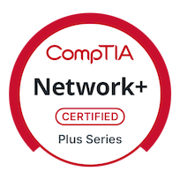

# 👋 Hi, I'm Chris Hegarty (CrackTheEgg)

🏗️ Former construction project manager now focused on building scalable, intelligent cloud systems with AWS.

## 🧭 My Mission
To combine my experience managing complex infrastructure projects with the power of AWS to design secure, resilient, and cost-effective cloud solutions.

## 🌱 Currently Working On
- ✅ AWS Cloud Practitioner (passed)
- 🧠 Studying for AWS SAA exam
- ⚙️ Building a progressive 11-project AWS portfolio
- 🚀 Project 1: [Lambda Hello World](https://github.com/CrackTheEgg/aws-lambda-hello-world)

## 🛠 Tools & Tech
`AWS` `Lambda` `API Gateway` `S3` `CloudFormation` `Terraform` `Python` `GitHub`

<h2>📜 Certifications</h2>

<a href="https://www.credly.com/badges/c352daae-90c4-453a-a241-2aef3c351894/public_url" target="blank">
  

✅ Edited from my Mac Studio using VS Code!

🔁 Test edit from VS Code — verifying push!
