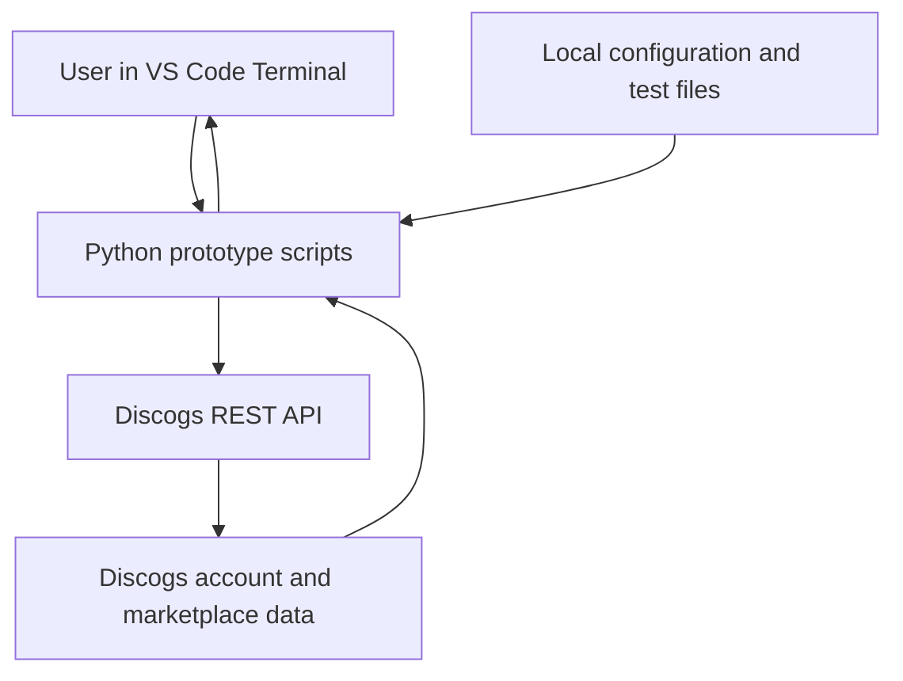
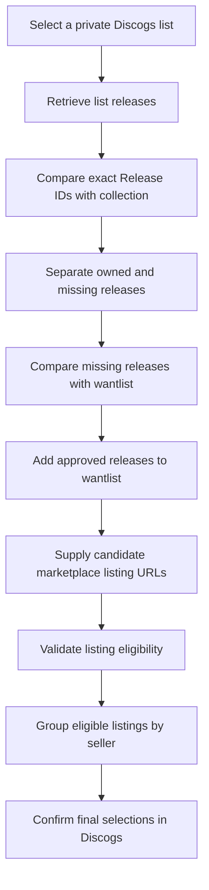
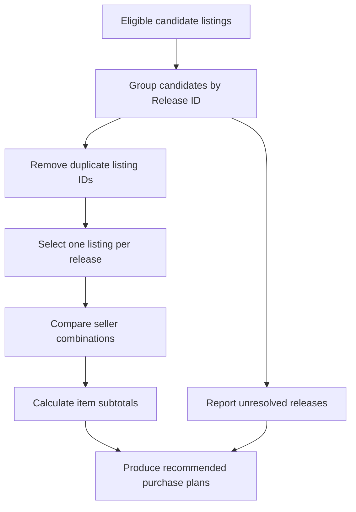
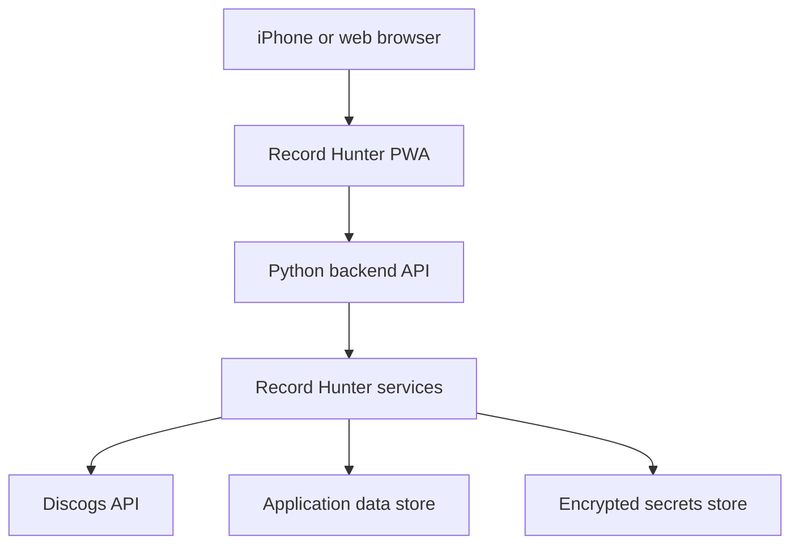
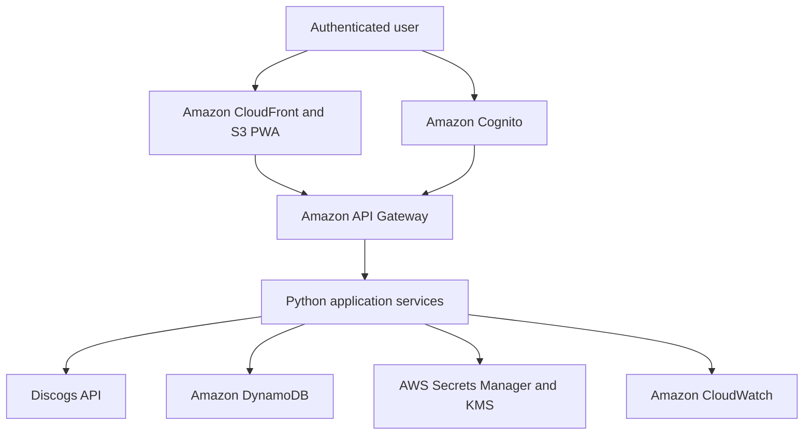
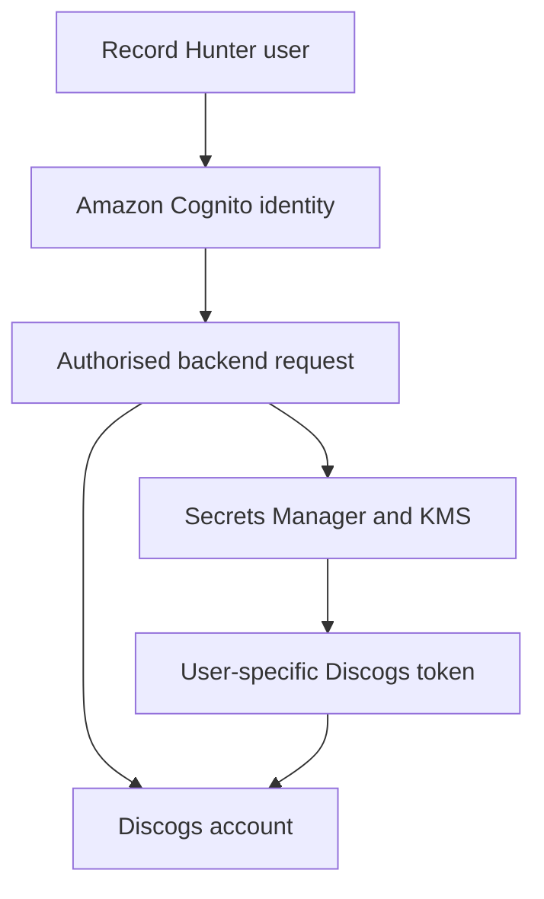

# Record Hunter Architecture

## Document purpose

This document describes the architecture of Record Hunter across three stages:

1. The current Python prototype.
2. The target single-user web application.
3. The future secure multi-user AWS application.

The architecture will evolve as the prototype is refactored and additional Discogs-supported functionality becomes available.

## Architecture objectives

Record Hunter is designed to:

* Retrieve private Discogs lists.
* Compare list releases against a collection and wantlist.
* Identify releases that still need to be purchased.
* Validate marketplace listings against user-defined rules.
* Select no more than one listing per required release.
* Group purchases efficiently by seller.
* Minimise item cost and unnecessary shipping charges.
* Retain explicit user confirmation before account changes or purchases.
* Protect Discogs credentials and user data.
* Provide an iPhone-friendly web interface.

## Current architecture — Python prototype

The current implementation is a collection of independently tested Python scripts running locally in a virtual environment.



### Current local components

| Component                        | Purpose                                                |
| -------------------------------- | ------------------------------------------------------ |
| `.env`                           | Stores the local Discogs personal access token         |
| `.venv/`                         | Isolated Python runtime and dependencies               |
| `requirements.txt`               | Records the Python package dependencies                |
| `candidate_links.txt`            | Reusable batch of candidate listing URLs               |
| `discogs_test.py`                | Tests Discogs authentication                           |
| `discogs_lists.py`               | Retrieves private user lists                           |
| `discogs_list_items.py`          | Retrieves releases from a selected list                |
| `discogs_collection_check.py`    | Compares list releases against the collection          |
| `discogs_wantlist_sync.py`       | Compares missing releases against the wantlist         |
| `discogs_wantlist_add.py`        | Adds approved releases to the wantlist                 |
| `discogs_marketplace_check.py`   | Retrieves marketplace availability statistics          |
| `discogs_listing_eligibility.py` | Validates an individual marketplace listing            |
| `discogs_batch_candidates.py`    | Validates listing batches and groups results by seller |
| `seller_test_results.txt`        | Local generated test output excluded from Git          |

## Current processing workflow



## Listing eligibility rules

The current validator applies the following rules:

| Attribute           | Current requirement             |
| ------------------- | ------------------------------- |
| Listing status      | For Sale                        |
| Media condition     | VG+ or better                   |
| Seller location     | United Kingdom                  |
| Seller rating       | 99% or higher                   |
| Seller rating count | At least 50                     |
| Item price          | Available and greater than zero |
| Currency            | GBP where supported             |

Sleeve condition is displayed for review but is not currently used as an exclusion rule.

## Purchasing optimiser design

The purchasing optimiser will operate only on eligible candidate listings.



### Optimisation outputs

The optimiser will produce several purchasing views:

1. **Lowest item-price plan**
   Select the cheapest eligible listing for every covered release without considering the number of sellers.

2. **Fewest-seller plan**
   Find a combination covering the greatest number of releases through the smallest number of sellers.

3. **Lowest subtotal within the fewest-seller plans**
   Where several seller combinations use the same number of sellers, select the combination with the lowest item subtotal.

4. **Unresolved releases**
   Report releases that have no eligible candidate listings.

5. **Shipping-sensitive decisions**
   Identify where a more expensive item from a combined seller could become cheaper after shipping is considered.

Shipping cannot yet be included reliably because the public listing API does not consistently return the buyer-specific shipping price. Final shipping must therefore be confirmed in the Discogs cart.

## Target application architecture

The target application will separate the interface, business logic and external Discogs integration.



### Target application layers

| Layer                | Responsibility                                                   |
| -------------------- | ---------------------------------------------------------------- |
| Presentation         | Responsive HTML, CSS and JavaScript Progressive Web App          |
| API                  | Validated requests between the interface and backend             |
| Discogs client       | Authentication, pagination, API requests and rate-limit handling |
| List service         | Retrieves and analyses selected Discogs lists                    |
| Collection service   | Compares exact Release IDs against owned records                 |
| Wantlist service     | Performs read-only checks and confirmed updates                  |
| Marketplace service  | Retrieves and validates candidate listings                       |
| Optimisation service | Selects and compares purchasing combinations                     |
| Security service     | Protects user identity, tokens and authorisation                 |
| Persistence          | Stores preferences, analysis runs and non-sensitive results      |

## Future AWS architecture

The planned AWS architecture will support secure access from an iPhone or desktop browser.



### Proposed AWS services

| AWS service              | Proposed responsibility                                   |
| ------------------------ | --------------------------------------------------------- |
| Amazon Cognito           | User registration, authentication and session management  |
| Amazon S3                | Static Progressive Web App hosting                        |
| Amazon CloudFront        | Secure global delivery of the web interface               |
| Amazon API Gateway       | Controlled entry point to backend services                |
| AWS Lambda or containers | Python business logic and Discogs integration             |
| Amazon DynamoDB          | User preferences, saved analyses and application state    |
| AWS Secrets Manager      | Protected storage for service credentials and user tokens |
| AWS KMS                  | Encryption of sensitive token data                        |
| Amazon CloudWatch        | Logs, metrics, monitoring and operational alerts          |

The final compute choice between AWS Lambda and a container service will be made after measuring execution time, API-call volume and optimiser requirements.

## Multi-user security model



Security requirements include:

* Each user must authenticate independently.
* Each Discogs token must be associated with one authorised user.
* Tokens must never be returned to the browser.
* Tokens must be encrypted at rest.
* Backend services must use least-privilege AWS permissions.
* Logs must never contain access tokens.
* Account-changing actions must require explicit user confirmation.
* Purchase confirmation and payment must remain within supported Discogs mechanisms.

A future production application should use the supported Discogs OAuth flow rather than asking users to paste personal access tokens into the browser.

## Discogs integration boundary

Record Hunter will use supported Discogs interfaces only.

The current public API supports functions including:

* Authentication and identity.
* User lists.
* Collection folders and releases.
* Wantlist retrieval and updates.
* Marketplace release statistics.
* Individual marketplace listing inspection.
* Seller inventory retrieval.

Current constraints include:

* No supported general buyer marketplace search equivalent to all website filters.
* No supported buyer-cart management endpoint for this workflow.
* No reliable buyer-specific shipping calculation from listing inspection.
* API rate limits.
* Marketplace listings may change or sell between analysis and checkout.

Record Hunter will not scrape Discogs webpages or attempt to bypass unsupported functionality.

## Failure and exception handling

The target application must handle:

| Condition               | Required behaviour                                        |
| ----------------------- | --------------------------------------------------------- |
| HTTP 401 or 403         | Stop the operation and request reauthentication           |
| HTTP 404                | Mark the release or listing as unavailable                |
| HTTP 429                | Pause according to the retry information and retry safely |
| HTTP 5xx                | Retry a limited number of times with backoff              |
| Listing sold            | Remove it from the candidate plan                         |
| Price changed           | Require refreshed confirmation                            |
| Missing shipping price  | Mark shipping for Discogs-cart confirmation               |
| Partial list retrieval  | Do not produce a final recommendation                     |
| Wantlist update failure | Report the specific failed Release ID                     |
| No eligible candidate   | Retain the release as unresolved                          |

## Planned code structure

The prototype scripts will eventually be refactored into reusable modules:

```text
Chapter_4_Record_Hunter/
├── README.md
├── requirements.txt
├── docs/
│   └── architecture.md
├── data/
│   └── candidate_links.txt
├── record_hunter/
│   ├── __init__.py
│   ├── config.py
│   ├── discogs_client.py
│   ├── lists.py
│   ├── collection.py
│   ├── wantlist.py
│   ├── marketplace.py
│   ├── eligibility.py
│   └── optimiser.py
├── tests/
│   ├── fixtures/
│   └── test_optimiser.py
└── app.py
```

This is a target structure. The current prototype scripts will remain available until their behaviour has been reproduced and tested in the reusable modules.

## Architectural decisions

| Decision                       | Rationale                                                                 |
| ------------------------------ | ------------------------------------------------------------------------- |
| Exact Release ID comparison    | Prevents different pressings from being treated as the same owned release |
| Explicit wantlist confirmation | Avoids unapproved Discogs account changes                                 |
| VG+ minimum media grade        | Establishes a consistent purchasing-quality threshold                     |
| UK seller requirement          | Reduces international shipping and import complexity                      |
| Seller rating thresholds       | Reduces marketplace purchasing risk                                       |
| Batch test files               | Provides repeatable regression testing                                    |
| Discogs cart confirmation      | Keeps shipping, payment and final approval within Discogs                 |
| Separate frontend and backend  | Prevents tokens from being exposed in browser code                        |
| AWS-managed security services  | Supports encrypted, auditable multi-user operation                        |

## Delivery stages

| Stage | Deliverable                     |
| ----- | ------------------------------- |
| 1     | Working local Python prototype  |
| 2     | Purchasing optimiser            |
| 3     | Refactored Python application   |
| 4     | Local web interface             |
| 5     | AWS-hosted single-user alpha    |
| 6     | Secure multi-user application   |
| 7     | Discogs-supported cart hand-off |

## Current architecture status

The current prototype has validated the main data-processing assumptions. The immediate next step is to implement and test the purchasing optimiser using the reusable candidate-list batch.

This document will be updated whenever a significant architectural decision or deployment stage changes.
